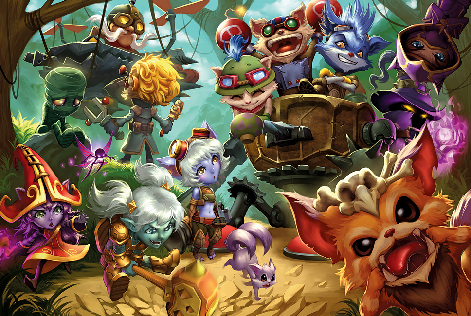

# lol-champs



<p align="center">
<a href="https://fanart.na.leagueoflegends.com/en_US/collection/Quirkilicious/"> Art By❤️ QUIRKILICIOUS</a>
</p>

<p align="center">
  <a href="https://travis-ci.org/jeffminsungkim/lol-champs">
  </a>
  <a href="https://www.npmjs.com/package/lol-champs">
  </a>
  <a href="https://github.com/facebook/jest">
  </a>
  <a href="https://github.com/prettier/prettier">
  </a>
  <a href="https://www.npmjs.com/package/lol-champs">
  </a>
  <a href="https://github.com/jeffminsungkim/lol-champs/blob/master/license">
  </a>
</p>

> Get champion names of League of Legends

## Install

```
$ npm install lol-champs
```

## Usage

```js
// ES6
import * as lolChamps from 'lol-champs';

// CommonJS
const lolChamps = require('lol-champs');

lolChamps.all();
//=> ['Wukong', 'Jax', ...]

lolChamps.getName(222);
//=> 'Jinx'

lolChamps.getId('Ezreal');
//=> 81

```


## API

### .all(lang: string = 'en') : string[]

Get a list of entire names.

#### lang

[Language code](#supported-languages) to retrieve the list of champion names.

```js
lolChamps.all();
//=> ['Wukong', 'Jax', ...]

lolChamps.all('zh-Hans');
//=> ['齐天大圣', '武器大师', ...]
```

### .getChampion(name: string, lang: string = 'en') : object

Get champion data by using name.

#### lang

[Language code](#supported-languages) to retrieve the champion data.

```js
lolChamps.getChampion('Cassiopeia');
//=> { title: 'the Serpent's Embrace', id: 69, key: 'Cassiopeia', name: 'Cassiopeia'},

lolChamps.getChampion('Ли Син', 'ru');
//=> { title: 'Слепой монах', id: 64, key: 'LeeSin', name: 'Ли Син' }
```

### .random(lang: string = 'en') : string

Get a random champion name that's **never the same as the previous**.

```js
lolChamps.random();
lolChamps.random();
//=> 'Fizz'
//=> 'Thresh'

lolChamps.random('ko');
lolChamps.random('ko');
//=> '야스오'
//=> '티모'

lolChamps.random('zh-Hans');
lolChamps.random('zh-Hans');
//=> '蒸汽机器人'
//=> '时间刺客'

lolChamps.random('ru');
lolChamps.random('ru');
//=> 'Катарина'
//=> 'Пантеон'

lolChamps.random('ja');
lolChamps.random('ja');
//=> 'トリスターナ'
//=> 'ソラカ'
```

### .getName(champId: number, lang: string = 'en') : string

Get champion name by using ID.

#### lang

[Language code](#supported-languages) to retrieve the name of champion.

```js
lolChamps.getName(35);
//=> 'Shaco'

lolChamps.getName(35, 'ko');
//=> '샤코'
```

### .getId(name: string, lang: string = 'en') : string

Get champion ID by using name.

#### lang

[Language code](#supported-languages) of the localized name.

```js
lolChamps.getName('Amumu');
//=> '32'

lolChamps.getName("Амуму", 'ru');
//=> '32'
```

### .languages : Set<string>

Check supported languages.

```js
lolChamps.languages.has('de');
//=> true
```

## Supported languages

Champion names are available for the following languages:

- `cs` (Czech)
- `de` (German)
- `el` (Greek)
- `en` (English)
- `fr` (French)
- `hu` (Hungalian)
- `it` (Italian)
- `ja` (Japanese)
- `ko` (Korean)
- `pl` (Polish)
- `pt` (Portuguese)
- `ru` (Russian)
- `tr` (Turkish)
- `vn` (Vietnamese)
- `zh-Hans` (Simplified Chinese)
- `zh-Hant` (Traditional Chinese)

The language codes follow the [IETF BCP 47 standard](https://en.wikipedia.org/wiki/IETF_language_tag).

## License

MIT © [JeffMinsungKim](https://jeffminsungkim.com)
